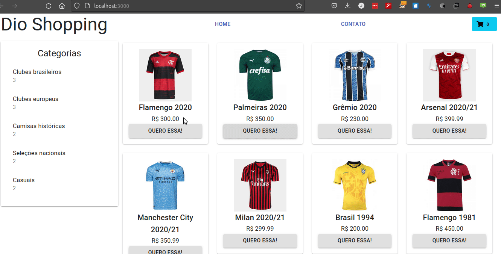

# E-commerce completo com React, Redux, Material UI e Bootstrap

Projeto guiado por Nataly, uma das melhores instrutoras da DIO.

Desenvolva um e-commerce usando React com Redux, além de explorar duas das principais soluções de estilo, o Material UI e o Bootstrap. Para isso, a expert apresenta uma abordagem totalmente prática de desenvolvimento, onde dicas e boas práticas fazem parte do seu percurso


## Instalando as dependências

<details>
<summary><strong>Instalando o Yanr no Linux (debian/ubuntu)</strong></summary>

- [ ]  Adicone o repositório do Yarn
```
echo "deb https://dl.yarnpkg.com/debian/ stable main"
| sudo tee /etc/apt/sources.list.d/yarn.list
```
- [ ]  Baixe a chave pública do repositório
```
curl -sS https://dl.yarnpkg.com/debian/pubkey.gpg | sudo apt-key add -
```
- [ ] Atualize a lista de pacores e instale o Yarn
```
sudo apt-get update && sudo apt-get install yarn
```
</details>

<details>
<summary><strong>Instalando Dependências</strong></summary>
Todas as dependências estão no 

```
yarn install
```
</details>

<details>
<summary><strong>Iniciando o servidor</strong></summary>

```
yarn start
```
</details>

## Demo


